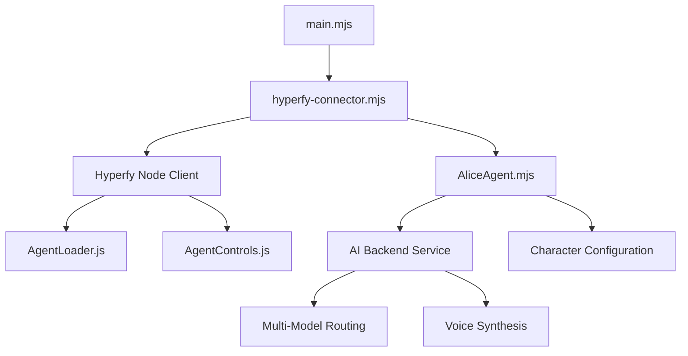

# Alice in Hyperfy Wonderland


## Innovative AI Character in the 3D Metaverse

*Alice in Hyperfy Wonderland* is a groundbreaking integration of an AI personality within the Hyperfy 3D virtual environment. This project brings Lewis Carroll's beloved character to life in the metaverse, creating an interactive, autonomous presence with whom users can engage in natural conversation and shared activities.

## 🌟 Key Features

- 🤖 **AI-Powered Personality**: Alice with authentic Wonderland dialogue and behaviors
- 🌐 **Hyperfy 3D Integration**: Seamless presence in immersive virtual worlds  
- 🧠 **Multi-Model AI Backend**: Combines multiple AI models for enhanced intelligence
- 🗣️ **Voice Synthesis**: Optional voice interaction using ElevenLabs
- 🏃 **Natural Movement**: Proximity awareness and realistic locomotion
- 💬 **Contextual Responses**: Conversation that adapts to topics and environment
- 🔌 **Modular Architecture**: Easily extensible for new capabilities

## 📋 Quick Start

### Prerequisites

- Node.js v18+
- A running Hyperfy instance
- (Optional) Docker and Docker Compose for full deployment

### Basic Installation

1. Clone the repository:
   ```bash
   git clone https://github.com/yourusername/alice-in-hyperfy.git
   cd alice-in-hyperfy
   ```

2. Install dependencies:
   ```bash
   npm install
   ```

3. Configure environment:
   ```bash
   cp .env.example .env
   # Edit .env with your settings
   ```

4. Run Alice:
   ```bash
   npm run hyperfy:connect
   ```

### Docker Deployment (Full Stack)

For the complete experience with AI backend:

1. Set up environment variables:
   ```bash
   cp .env.example .env
   # Edit .env with your API keys
   ```

2. Prepare the shared directory:
   ```bash
   mkdir -p backend physics shared
   cp simple-agent/avatar.vrm shared/alice_avatar.vrm
   cp simple-agent/alice-config.json shared/alice_character.json
   ```

3. Start with Docker Compose:
   ```bash
   docker-compose up -d
   ```

## 🧩 Architecture

Alice in Hyperfy Wonderland uses a modular component architecture:



## 🤔 The Innovation

What makes this project unique:

1. **Character Embodiment**: Rather than just a text interface, Alice exists as a full character within the 3D space, with appropriate movements, behaviors, and interactions.

2. **Multi-Modal Interaction**: Alice combines text chat, proximity awareness, animations, and optional voice for a truly immersive experience.

3. **Metaverse Integration**: By connecting an AI character to Hyperfy, we create one of the first examples of autonomous AI agents in the metaverse.

4. **Modular AI System**: The backend architecture supports multiple AI models for different types of interaction, from quick responses to deep reasoning.

5. **WebSocket Integration**: Real-time communication between all components enables fluid, responsive interaction.

## 📚 Documentation

Complete documentation is available in the `cline_docs` directory:

- [Project Roadmap](cline_docs/projectRoadmap.md)
- [Technical Stack](cline_docs/techStack.md)
- [Codebase Summary](cline_docs/codebaseSummary.md)
- [Integration Guide](cline_docs/hyperfy-agent-connector.md)
- [Next Steps Guide](cline_docs/next-steps.md)

## 📝 Configuration

Alice's personality and behavior can be customized by editing `simple-agent/alice-config.json`. This allows you to tailor everything from greeting styles to conversation patterns without changing code.

Environment variables control connection details and API keys, configured through the `.env` file. See `.env.example` for all options.

## 👩‍💻 Development

To extend Alice with new capabilities:

1. Add new methods to `AliceAgent.mjs` for additional behaviors
2. Enhance the AI backend in the `backend` directory
3. Add new animations to the `emotes` directory
4. Create custom voice responses

## 📜 License

This project is licensed under the MIT License - see the LICENSE file for details.

## 🙏 Acknowledgements

- [Hyperfy](https://hyperfy.io/) for the metaverse platform
- The Three.js community for 3D rendering technology
- The VRM Consortium for the avatar format standard
