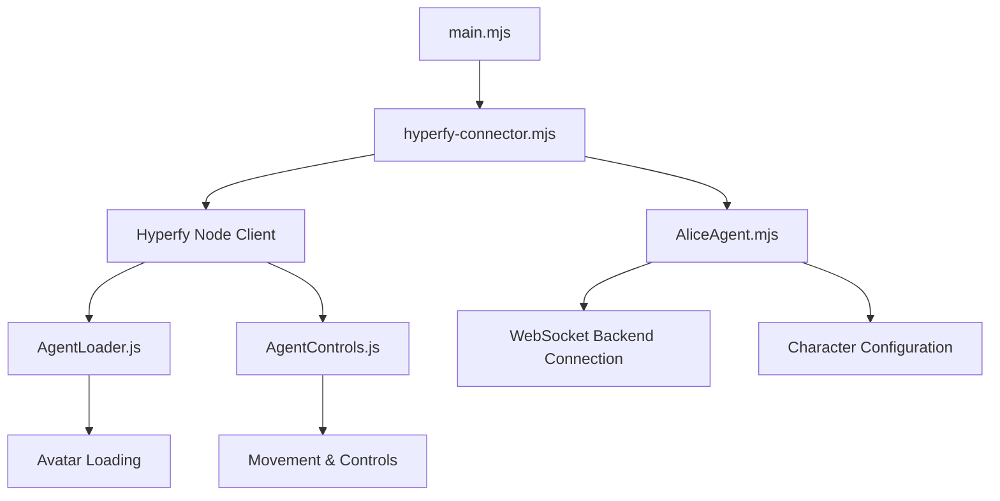

# Hyperfy Agent Connector Documentation

This document explains the integration between the Alice agent and the Hyperfy 3D platform, allowing Alice to exist and interact within a Hyperfy virtual environment.

## Architecture Overview

The integration consists of several key components:

1. **Hyperfy Node Client** - Connects to Hyperfy servers and provides core functionality
2. **AgentLoader** - Custom loader for avatar models and assets
3. **AgentControls** - Handles movement and interaction with the Hyperfy world
4. **AliceAgent** - The primary agent implementation with Alice's character/personality
5. **Connector** - Binds everything together and manages the connection lifecycle



## Key Components

### 1. AliceAgent.mjs

This is the core implementation of Alice's personality and behavior:

- Loads Alice's character configuration from JSON
- Manages WebSocket communication with backend services
- Handles chat messages, interactions, and responses
- Controls animations, movements, and emotes
- Implements idle behaviors (looking around, random emotes)
- Tracks interaction state and proximity to other users

### 2. AgentLoader.js

Custom loader for Hyperfy assets:

- Loads VRM avatar models with three.js integration
- Handles emote animations and other 3D assets
- Provides cached resources to improve performance
- Creates avatar nodes for rendering in Hyperfy

### 3. AgentControls.js

Controls how Alice interacts with the Hyperfy environment:

- Movement within the 3D space
- Basic physics interactions
- Camera positioning and orientation
- Animation control and blending

### 4. hyperfy-connector.mjs

Serves as the integration layer:

- Initializes Hyperfy client with our custom components
- Creates the AliceAgent instance and attaches it to the world
- Sets up event handlers for connection events
- Implements proximity detection for other users
- Manages lifecycle (connect, disconnect, cleanup)

## Connection Flow

1. **Initialization**:
   - Load environment variables and configuration
   - Create Hyperfy world with custom loader and controls
   - Initialize with avatar and connection details

2. **Connection**:
   - Connect to Hyperfy WebSocket server
   - Load Alice's avatar
   - Create AliceAgent instance

3. **Ready State**:
   - Start Alice's behaviors
   - Begin proximity detection
   - Set up chat listeners

4. **Interaction Loop**:
   - Detect nearby players
   - Process chat messages
   - Perform idle behaviors when not interacting
   - Move around the environment

5. **Shutdown**:
   - Clean up event listeners
   - Close WebSocket connections
   - Destroy world objects

## Configuration Options

Alice can be configured through environment variables or the `.env` file:

- `WS_URL` - WebSocket URL for Hyperfy connection
- `AGENT_NAME` - Display name in Hyperfy
- `LOCAL_AVATAR_PATH` - Path to VRM avatar file
- `ALICE_BACKEND_URL` - Optional backend service URL
- `CHARACTER_PATH` - Path to character configuration
- `DEBUG` - Enable verbose logging

## Character Configuration

Alice's personality is defined in `alice-config.json`, which includes:

- Biographical information
- Greeting and response styles
- Quotes and speech patterns
- Knowledge and interests
- Voice profile characteristics

## Docker Deployment

The complete system can be deployed using Docker Compose with three services:

1. **alice-backend** - The AI backend service (optional)
2. **hyperfy-agent** - The Hyperfy connector for Alice
3. **physics-service** - Optional physics simulation for enhanced interactions

## Usage

### Local Development

To run Alice locally:

```bash
# With npm
npm run hyperfy:connect

# Directly
node main.mjs
```

### Production Deployment

Using Docker Compose:

```bash
# Copy example environment file
cp .env.example .env

# Edit environment variables
nano .env  # Add your API keys and configuration

# Start services
docker-compose up -d
```

## Extending Alice

Alice can be extended in several ways:

1. **Enhanced Avatar** - Replace the VRM file with a custom avatar
2. **New Behaviors** - Add methods to the AliceAgent class
3. **Additional Animations** - Add emote animations to the emotes folder
4. **Backend Integration** - Connect to an AI service for dynamic responses

## Troubleshooting

Common issues and solutions:

1. **Connection Failures**:
   - Ensure Hyperfy is running and accessible
   - Check WS_URL is correct
   - Verify firewall or network settings

2. **Avatar Loading Issues**:
   - Confirm VRM file is valid and accessible
   - Check for console errors related to model loading
   - Try a different VRM file to isolate issues

3. **Performance Problems**:
   - Reduce the complexity of idle behaviors
   - Increase intervals between proximity checks
   - Use a simpler avatar model
