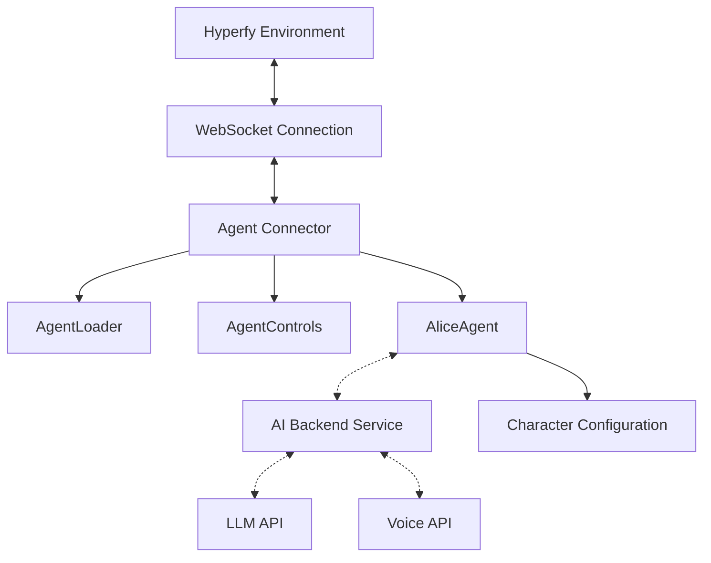

# Alice in Hyperfy Wonderland - Technology Stack

## Core Technologies

### Frontend/3D Environment
- **Hyperfy** - 3D virtual environment platform
- **Three.js** - 3D rendering library for WebGL
- **VRM** - 3D humanoid avatar format and runtime

### Agent Implementation
- **Node.js** - Runtime environment for the agent
- **ES Modules** - Modern JavaScript module system
- **WebSockets** - Real-time bidirectional communication

### Backend Services (Future)
- **Python** - Language for AI backend implementation
- **FastAPI** - API framework for WebSocket backend services
- **Docker** - Containerization for deployment
- **Docker Compose** - Multi-container orchestration

## Libraries & Dependencies

### Core Dependencies
- **ws** - WebSocket client for Node.js
- **dotenv** - Environment variable management
- **three.js** - 3D rendering and animation
- **@pixiv/three-vrm** - VRM format support for Three.js

### AI & Natural Language (Future/Optional)
- **OpenAI API** - GPT-based language generation
- **Anthropic API** - Claude language model for responses
- **ElevenLabs API** - Voice synthesis for audio output

### Development Tools
- **ESLint** - JavaScript linting
- **Prettier** - Code formatting
- **npm** - Package management

## Architecture Patterns

1. **Modular Component System**
   - Separation of concerns between loader, controls, and agent logic
   - Pluggable components that can be replaced or extended

2. **Event-Driven Architecture**
   - WebSocket events drive agent behavior
   - Reactive programming approach to environment changes

3. **Configuration-as-Code**
   - External configuration through environment variables
   - Character definition through structured JSON

4. **Service-Oriented Architecture** (Future)
   - Separate services for AI processing, physics, and voice synthesis
   - Communication via WebSockets and REST APIs

## Data Flow

## Development & Deployment

### Local Development
- **Node.js v22+** - Runtime environment
- **npm** - Package and script management
- **Local Hyperfy instance** - For testing

### Containerized Deployment
- **Docker** - Container runtime
- **Docker Compose** - Service orchestration
- **Alpine Linux** - Lightweight container base

### Infrastructure (Recommended)
- **VPS or Cloud Provider** - For hosting backend services
- **WebSocket Proxy** - For handling WebSocket connections
- **Reverse Proxy** - For SSL termination and routing

## Future Technical Considerations

1. **Performance Optimization**
   - Efficient avatar loading and rendering
   - Reduced WebSocket message frequency
   - Optimized animation blending

2. **Scalability**
   - Support for multiple agents in a single world
   - Distributed backend processing
   - Shared context between agents

3. **Security**
   - Authentication for backend API access
   - Rate limiting for API requests
   - Sanitized input processing

4. **Persistence**
   - User interaction history storage
   - Agent state persistence
   - Configuration management database
