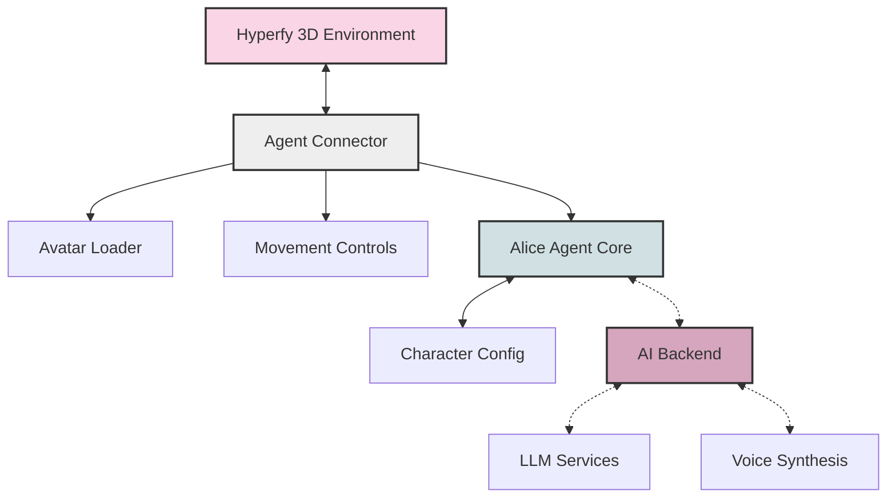
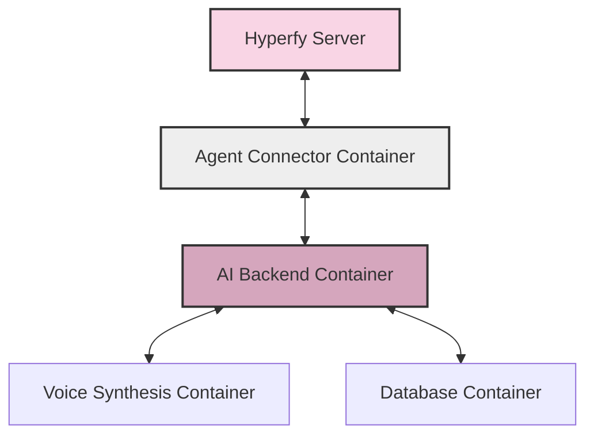

# System Architecture

The Alice in Hyperfy Wonderland project uses a modular, event-driven architecture to create an autonomous AI character in a 3D virtual environment. This document explains the key components and how they interact.

## High-Level Architecture

At a high level, the architecture consists of these primary systems:

The dotted lines represent optional components that enhance the system but aren't required for basic functionality.

## Core Components

### 1. Hyperfy Node Client

The foundation of the system is the Hyperfy Node Client, which provides a connection to the Hyperfy virtual world and allows our agent to:

- Exist as an avatar in the 3D space
- Detect other players and their locations
- Move through the environment
- Send and receive chat messages
- Play animations (emotes)

This component is initialized in the `hyperfy-connector.mjs` file and serves as the bridge between our agent and the Hyperfy world.

### 2. Agent Loader

The Agent Loader (`AgentLoader.js`) is responsible for:

- Loading the VRM avatar model
- Setting up animations and emotes
- Creating the visual representation of Alice
- Managing asset caching for performance

This component abstracts the complexity of 3D asset loading and provides a clean interface for the agent to control its appearance.

### 3. Agent Controls

The Agent Controls (`AgentControls.js`) handle:

- Movement through the environment
- Animation playback and blending
- Camera and perspective positioning
- Collision detection with the environment

This provides a higher-level movement API for the agent to use, abstracting the details of controlling the avatar in 3D space.

### 4. Alice Agent Core

The heart of the system is the Alice Agent (`AliceAgent.mjs`) which:

- Implements Alice's personality and behaviors
- Manages the state machine for different behavior modes (idle, interacting, etc.)
- Processes incoming chat messages
- Determines appropriate responses and actions
- Coordinates movements and animations

This component contains the "brain" of Alice, connecting her personality to the virtual world.

### 5. Character Configuration

Alice's personality is defined in `alice-config.json`, which includes:

- Biographical information
- Speech patterns and quotes
- Greeting styles
- Idle behaviors
- Response templates

This separation of configuration from code allows for easy customization of Alice's personality without changing the underlying system.

## Optional Components

### 1. AI Backend Service

For more advanced implementations, an AI backend service can be added to:

- Generate contextual responses using large language models
- Maintain conversation history and context
- Route requests to appropriate AI models based on the type of interaction
- Provide more sophisticated behaviors

This is implemented as a separate service that communicates with the Alice Agent via WebSockets.

### 2. Voice Synthesis

Voice capabilities can be added through integration with text-to-speech services like ElevenLabs:

- Convert Alice's text responses to speech
- Stream audio to listeners in the Hyperfy environment
- Synchronize mouth animations with speech

## Data Flow

The system operates through an event-driven architecture with the following primary data flows:

### Initialization Flow

1. `main.mjs` launches and sets up the environment
2. `hyperfy-connector.mjs` creates a Hyperfy world connection
3. `AgentLoader.js` loads Alice's avatar
4. `AliceAgent.mjs` is instantiated with the world reference
5. Character configuration is loaded from `alice-config.json`

### Interaction Flow

When a player approaches Alice:

1. Hyperfy proximity events trigger `onPlayerNearby()` in AliceAgent
2. Alice selects an appropriate greeting based on configuration
3. Movement is calculated using AgentControls
4. Chat messages are displayed to the player

When a player sends a chat message:

1. Message is received via Hyperfy's WebSocket
2. Message is routed to AliceAgent's `handleIncomingChat()`
3. If AI backend is available, message is sent there for processing
4. Response is generated (either locally or via AI)
5. Alice responds with text and appropriate animations

### Idle Behavior Flow

When no players are nearby:

1. Idle behavior timer triggers in AliceAgent
2. A random behavior is selected from configuration
3. Movement or animation commands are sent to AgentControls
4. Alice performs the selected idle behavior

## Communication Protocols

The system uses several communication protocols:

1. **WebSockets** - For real-time communication with Hyperfy and optional backend services
2. **JSON** - For structured data exchange between components
3. **Event Listeners** - For component-to-component communication within the Node.js environment

## Extensibility

The architecture is designed for extensibility through:

1. **Modular Components** - Each part of the system has a clear responsibility
2. **Configuration-Driven Behavior** - Many behaviors can be changed through configuration
3. **Event-Based Communication** - Components can be added or replaced by hooking into the event system
4. **Service Abstraction** - External services are abstracted behind interfaces

## Deployment Architecture

For production deployments, a multi-container architecture is recommended:

This separation allows for:
- Independent scaling of components
- Resilience to component failures
- Easier updates and deployments
- Separation of concerns and responsibilities

## Security Considerations

The architecture implements security best practices:

1. All API keys and secrets are stored in environment variables, not in code
2. WebSocket connections can be secured with TLS
3. Configuration for production deployments includes proper encryption
4. Input validation is performed on all user-provided data

## Performance Optimizations

Several performance optimizations are implemented:

1. Asset caching for 3D models and animations
2. Throttling of proximity checks to reduce computation
3. Efficient animation blending for smooth motion
4. Limited path computation for natural movement
