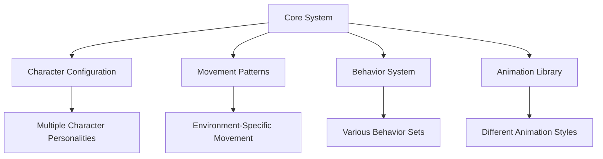

# Innovation in AI Character Integration

The Alice in Hyperfy Wonderland project represents a significant advancement in how AI characters can be integrated into 3D virtual environments. This document highlights the innovative approaches we've taken and their implications for the future of AI in the metaverse.

## Moving Beyond Text-Based AI

While most AI interactions today happen through text-based interfaces (chatbots, assistants) or 2D representations, Alice in Hyperfy Wonderland creates a fully embodied 3D presence that:

1. **Exists physically in virtual space**
2. **Moves autonomously through the environment**
3. **Engages with users through proximity and body language**
4. **Maintains consistent character identity**

This represents a fundamental shift from AI as a "service" to AI as an "entity" with whom users can share virtual spaces.

## Technical Innovations

### 1. Modular Character Architecture

The system separates character definition from technical implementation through:

This separation allows:
- Rapid creation of new characters without rewriting code
- Specialized behavior patterns for different environments
- Collaborative development between technical and creative teams

### 2. Real-Time Event-Driven Behavior System

Traditional AI systems operate on a request-response model. Alice uses an event-driven system that:

- Continuously monitors the environment for relevant events
- Manages multiple concurrent behavior sequences
- Transitions naturally between different behavior states
- Responds to unplanned events (like a player approaching)

This creates more organic, life-like behavior that feels less scripted.

### 3. Multi-Model AI Routing

Rather than relying on a single AI model, the backend architecture supports multiple specialized models:

- Fast, small models for simple interactions
- Large, sophisticated models for complex reasoning
- Specialized models for particular topics or behaviors
- Rule-based systems for predictable responses

This "AI model routing" allows for both quick responses and deep, thoughtful interactions where appropriate.

### 4. WebSocket-Based Integration

The integration with Hyperfy uses bidirectional WebSocket communication that:

- Provides real-time updates about the environment
- Allows for responsive, low-latency interactions
- Enables streaming of both data and audio
- Supports synchronization of multiple clients

This creates a much more fluid experience than traditional HTTP request-based systems.

## User Experience Innovations

### 1. Spatial Awareness

Alice doesn't just respond to text - she's aware of her spatial relationship to users:

- Recognizes when users approach or leave
- Adjusts interactions based on proximity
- Navigates around obstacles naturally
- Orients herself toward conversation partners

This creates a more immersive, natural feeling interaction that considers physical context.

### 2. Multi-Modal Interaction

The interaction model combines multiple channels:

- Text chat for primary communication
- Animations and emotes for non-verbal expression
- Movement and positioning for spatial context
- Voice synthesis for audio output (in advanced implementations)

This creates a richer, more nuanced form of communication that better mirrors human interaction.

### 3. Character Continuity

Alice maintains a consistent character identity:

- Speech patterns that match her literary origins
- Behaviors appropriate to her personality
- Memory of previous interactions (with backend)
- Contextually appropriate references to Wonderland

This creates a coherent experience where users feel they're interacting with a specific character, not a generic AI.

## Future Implications

The innovations in this project point toward several important future developments:

### 1. AI as Social Entities

As virtual worlds become more prevalent, AI characters will increasingly serve as:

- Guides and companions in virtual spaces
- Representatives for brands or organizations
- Performers and entertainers
- Social catalysts that bring users together

This will fundamentally change how we think about AI - less as tools and more as entities with whom we share social spaces.

### 2. Distributed Intelligence

The architecture demonstrates how intelligence can be distributed across:

- Local client-side logic for immediate responses
- Server-side models for complex reasoning
- Environment systems for contextual awareness
- Shared knowledge bases for consistent information

This distributed approach creates more resilient, responsive AI systems.

### 3. Character Ecosystems

The modular character system points toward future "ecosystems" of AI characters that:

- Interact with each other as well as users
- Form relationships and social structures
- Develop over time based on experiences
- Create emergent social dynamics

This would transform virtual worlds from static environments to living social spaces.

## Challenges and Future Work

While the project represents significant innovation, several challenges remain:

### 1. Animation Limitations

Current VRM animation systems have limitations in:

- Facial expression range
- Fine motor control
- Natural blending between animations
- Procedural movement generation

Future work will focus on more sophisticated animation systems.

### 2. Contextual Understanding

While the AI can respond to text, truly understanding the 3D context remains challenging:

- Understanding the meaning of virtual objects
- Recognizing complex social situations
- Interpreting group dynamics
- Making appropriate environmental references

Future iterations will focus on deeper environmental understanding.

### 3. Persistent Memory

Creating truly persistent characters requires:

- Long-term memory systems
- Identity continuity across sessions
- Learning from past interactions
- Evolving relationships with specific users

These are active areas of research for future development.

## Conclusion

The Alice in Hyperfy Wonderland project demonstrates how AI can move beyond traditional interfaces to become embodied, social entities in virtual spaces. By combining 3D presence, character-driven behavior, multi-modal interaction, and sophisticated AI, it creates a foundation for a new generation of AI experiences in the metaverse.
